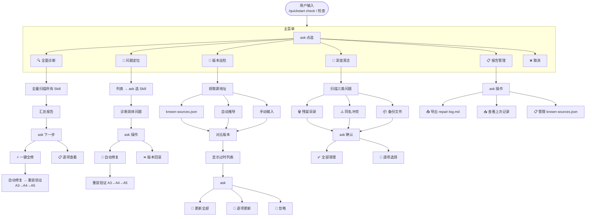

## 概述

你开源了一个项目，想让别人复制一句话丢给 AI 就能装好？或者想给已有项目生成标准安装入口？

**quickstart** 就是干这个的。它是一个「一言装」安装工具：

1. **📥 安装适配**：给一个 Skill 链接或文件，自动检测你当前用的 AI Agent，转成你能用的格式并装好
2. **🔧 检查**：列出你装过的所有 Skill，检查哪个有问题，修好重装
3. **🏗️ 生成 Install.md**：为项目生成唯一的 `Install.md`，任何 AI Agent 读它就知道怎么装这个 Skill

---

## 执行指令

### Step 0: 解析用户输入 + 路由

用户调用 `/quickstart`，AI 根据输入内容灵活判断意图：

| 输入 | 行为 |
|------|------|
| 无参数 | 用 ask 列出三种模式让用户点选 |
| URL / 本地路径 / 文件 | AI 尝试读取 → 判断是不是 Skill → 走安装适配 |
| 含「检查」「check」关键词 | 走检查 |
| 含项目意图（「就这个项目」「适配」等） | 走生成 Install.md |
| 其他内容 | AI 自行理解意图，不确定则 ask 确认 |

> **核心原则**：不硬编码匹配规则，AI 灵活理解用户意图。

---

### Step 1: 环境预检

运行以下命令检查环境：

```bash
git --version
curl --version
```

> ⛔ **sudo 禁令**：绝对禁止使用 `sudo` / `runas` / 管理员权限执行任何命令。遇权限错误立即中断并告知用户。
> 
> 任一工具缺失 → 提示用户手动安装，流程结束。

---

## 安装适配

### A1: 获取目标 Skill

根据输入内容，用对应方式获取：

| 输入类型 | 获取方式 |
|---------|---------|
| 远程 URL（GitHub 项目链接 / 任意 .md 直链） | 见下方「URL 解析规则」 |
| 本地路径 | `read_file` 读取 |
| 文本内容（非 URL/路径） | 无法自动定位 → 用 ask 询问用户提供链接或路径，不要自行猜测 |

> **URL 解析规则：** 用户给的不一定是直链，需要逐层探测：
> 1. GitHub 项目链接 → 先试探 `raw.githubusercontent.com/user/repo/main/SKILL.md`，404 则试探 `<项目名>.md`，仍 404 则 `git clone` 到临时目录
> 2. `.md` 直链 → 直接 `curl` 下载
> 3. 全部失败 → 告知用户无法获取，流程结束

下载/读取后，将内容保存在变量 `{skill_content}` 中。

### A2: 校验是否为 Skill

检查 `{skill_content}` 是否包含有效的 Skill frontmatter：

```yaml
---
name: skill-name
description: 一句话描述
runAs: inline  # 或 subagent
---
```

检查项：
- **必须**有 `---` frontmatter 块
- **必须**有 `name` 字段
- **推荐**有 `description` 字段
- **推荐**有 `runAs` 字段

如果有缺失，用 ask 询问用户补充。同一字段 ask 超过 2 次仍无效（用户未提供有效值）→ 告知用户无法继续，流程结束。

```
❌ 不是有效的 Skill → 告知用户，流程结束
✅ 是有效的 Skill → 进入下一步
```

### A3: 检测当前 Agent 类型

检测当前运行环境，判断自己是什么 Agent（不限于以下）：

| 常见信号 | Agent 类型 |
|---------|-----------|
| 存在 `install_source` 工具 / `.reasonix/` 目录 | Reasonix |
| 存在 `~/.claude/` 目录 / `claude` CLI | Claude Code |
| 存在 `.cursor/rules/` 目录 / `.cursorrules` | Cursor |
| 以上都不匹配 | 通用兼容模式 |

> AI 自行判断当前环境；如果你知道自己是什么 Agent，直接使用对应安装方式。

### A4: 安装适配

根据检测到的 Agent 类型，将 Skill 装到对应位置：

1. 确定你的 Skill 安装目录（例如 `~/.reasonix/skills/{skill-name}/`、`~/.claude/skills/{skill-name}/`、`.cursor/rules/` 等）
2. 将 Skill 文件写入该目录
3. 如果来源是远程 URL，先下载再安装

> ⛔ **sudo 禁令**：禁止 `sudo` / `runas` 提权，遇权限错误立即中断并告知用户。
>
> AI 自行决定具体安装命令，核心目标：用户能通过 `/{skill-name}` 调用。

### A5: 验证安装

确认安装成功后告知用户：

> ✅ **安装完成！**
> 📥 Skill `{skill-name}` 已装到 {Agent 类型}
> 你现在可以直接使用：`/{skill-name}`
> 
> 📍 安装位置：{安装路径}

---

## 检查



---

### Level 1 — 主菜单

进入检查模式后，先弹出主菜单让用户点选：

> ask(questions=[{
>   header: "🔧 检查",
>   question: "请选择要执行的操作：",
>   options: [
>     { label: "🔍 全面诊断", desc: "扫描所有 Skill，一次性查出全部问题" },
>     { label: "🔧 问题定位", desc: "选一个 Skill 单独诊断修复" },
>     { label: "🔄 版本巡检", desc: "检查已安装 Skill 是否有新版本" },
>     { label: "🧹 深度清洁", desc: "清理残留目录 / 冲突文件 / 备份" },
>     { label: "📋 报告管理", desc: "导出诊断报告 / 管理源列表" },
>     { label: "❌ 取消" },
>   ]
> }])

---

### ① 全面诊断

全量扫描所有已安装 Skill，汇总报告：

```
📊 全面诊断报告
┌──────────────┬────────┬──────────────────┐
│ Skill        │ 状态   │ 问题              │
├──────────────┼────────┼──────────────────┤
│ quickstart   │ ✅ 正常│ —                │
│ soulcheck    │ ⚠️ 异常│ description 缺失  │
│ xxx          │ ❌ 异常│ 文件损坏           │
└──────────────┴────────┴──────────────────┘
```

报告后 ask 用户下一步：

> ask(questions=[{
>   header: "诊断完成",
>   question: "共扫描 3 个 Skill：1 正常，2 有问题。请选择操作：",
>   options: [
>     { label: "⚡ 一键全修", desc: "自动修复所有可自动修复的问题" },
>     { label: "📋 逐项查看", desc: "逐个展示每个 Skill 的诊断详情" },
>     { label: "↩️ 返回主菜单" },
>   ]
> }])

- **一键全修**：自动补全缺失字段、修正路径、移动文件，全部修完后统一走 A3→A4→A5 重装验证
- **逐项查看**：逐个展示诊断详情，每个 Skill 修完再进下一个

---

### ② 问题定位

扫描列表 → ask 选一个 Skill → 诊断问题（同下方 B2 诊断表）：

> ask(questions=[{
>   header: "诊断结果",
>   question: "「{skill-name}」检测到以下问题，请选择操作：",
>   options: [
>     { label: "🤖 自动修复", desc: "AI 自动补全/修正/重装" },
>     { label: "🛠️ 手动指定", desc: "由用户告诉怎么修" },
>     { label: "⏪ 版本回滚", desc: "有备份则还原到上一版本" },
>     { label: "↩️ 返回主菜单" },
>   ]
> }])

**诊断表（通用）：**

| 问题 | 检测方式 | 修复方法 |
|------|---------|---------|
| frontmatter 缺失 | 不以 `---` 开头 | ask 用户提供 name/description/runAs |
| `name` 字段缺失 | frontmatter 中没有 name | ask 用户输入 Skill 名称 |
| `description` 字段缺失 | frontmatter 中没有 description | ask 用户输入一句话描述 |
| `runAs` 字段缺失或错误 | 不是 inline/subagent | ask 用户选择运行方式 |
| 安装路径不对 | Skill 文件在错误的位置 | 移动到正确的 Agent 目录 |
| 文件内容损坏 | 为空或无效 Markdown | 告知用户重新下载；如果记得原来源，引导用户从原项目重新获取；无法找回则建议用户联系原作者 |

**修复规则：**
- ⛔ **sudo 禁令**：禁止 `sudo` / `runas` 提权，遇权限错误立即中断
- 修复完成后**必须走 A3→A4→A5** 重装验证

> ✅ **完成！** `{skill-name}` 已修复，你现在可以试试 `/{skill-name}`

---

### ③ 版本巡检

检查已安装 Skill 是否与源仓库版本一致。源地址获取优先级：

1. 本地 `known-sources.json`（手动维护的源列表）
2. 自动推导：从安装路径的 Agent 目录 + Skill name 拼接 raw 直链试探
3. 手动输入：ask 用户输入源地址

对比版本后显示过时列表：

> ask(questions=[{
>   header: "版本巡检",
>   question: "发现 2 个 Skill 有新版本，请选择操作：",
>   options: [
>     { label: "🔄 更新全部", desc: "下载最新版并重新安装" },
>     { label: "📝 逐项选择", desc: "选哪些更新，哪些跳过" },
>     { label: "🙈 忽略本次" },
>   ]
> }])

更新流程：下载最新版 → 覆盖安装 → A5 验证

---

### ④ 深度清洁

扫描三类问题，列出确认后清理：

| 类型 | 说明 |
|------|------|
| 🗑️ 残留目录 | Skill 已删除但安装目录还在的空文件夹 |
| ⚠️ 同名冲突 | 同一 Skill name 出现在多个目录（重复安装） |
| 📦 备份文件 | 之前修复留下的 `.bak` 旧版本文件 |

> ask(questions=[{
>   header: "深度清洁",
>   question: "发现 3 个可清理项，请选择操作：",
>   options: [
>     { label: "✅ 全部清理" },
>     { label: "📝 逐项选择", desc: "逐个确认是否删除" },
>     { label: "↩️ 返回主菜单" },
>   ]
> }])

---

### ⑤ 报告管理

> ask(questions=[{
>   header: "报告管理",
>   question: "请选择操作：",
>   options: [
>     { label: "📤 导出诊断报告", desc: "生成 repair-log.md" },
>     { label: "📥 查看上次记录", desc: "读取已存在的 repair-log.md" },
>     { label: "📋 管理源列表", desc: "增删 known-sources.json 中的条目" },
>     { label: "↩️ 返回主菜单" },
>   ]
> }])

**`known-sources.json` 格式：**

```json
{
  "sources": [
    { "name": "quickstart", "url": "https://github.com/Kepsilent/quickstart" },
    { "name": "soulcheck", "url": "https://github.com/user/soulcheck" }
  ]
}
```

存储在 Skill 安装目录的公共位置（如 `~/.reasonix/known-sources.json`），由用户或 AI 手动维护。

---

## 生成 Install.md

> 产物：项目根目录下的 `Install.md`，纯给 AI Agent 读的。

### C1: 确定目标目录

| 参数 | 行为 |
|------|------|
| `就这个项目` / `当前项目` | 目标 = `pwd` |
| `/绝对/路径` | 目标 = 该路径 |
| 项目名 | 在常见项目目录中查找 |
| 无参数 | ask 让用户点选或输入目录 |

### C2: 获取项目链接

生成 Install.md 必须要有项目链接，AI 按以下逻辑处理：

1. **先取项目链接**：查看当前项目是否有 git remote origin（`git remote get-url origin`）→ 自动提取 GitHub 链接
2. 没有 remote 或不是 GitHub → 用 ask 让用户输入 GitHub 仓库链接
3. 用户没有链接 → 提醒需要先发布项目到 GitHub 才能生成安装入口

### C3: 生成 Install.md

在项目根目录生成 `Install.md`，内容包含：

- 项目名称
- 项目介绍（用户原来怎么写就怎么保留）
- **项目链接**（C2 获取的）—— 告诉 AI 去哪里拿这个 Skill
- 安装指引：AI 读了就知道要装什么、怎么装

同时在 README.md **第一个 `---` 分隔线之后**注入一个「🚀 一键安装」独立板块（不要动 README 其他内容）。

> Install.md 是「拼图」，SKILL.md 是「零件」—— 链接告诉 AI「去哪里买零件」。

### C4: 发布指引 + 安装咒语

Install.md 生成后，引导用户：

1. 把 Install.md 连同项目一起发布到对应平台
2. 发布后，根据平台拼出 Install.md 的 raw 直链：
   - **GitHub** → `https://raw.githubusercontent.com/{用户}/{仓库}/main/Install.md`
3. 咒语 = 该直链，用户复制丢给 AI 即可自动安装

> 发布后把 Install.md 直链丢给 AI，AI 自己读文件、自己完成安装。

---

## 附录：Skill 文件查找优先级

AI 在目标目录找 Skill 文件时，按以下优先级：

1. 根目录的 `SKILL.md`
2. 根目录有 frontmatter（`---`）的 `.md` 文件
3. 无法找到 → 询问用户 Skill 文件在哪
